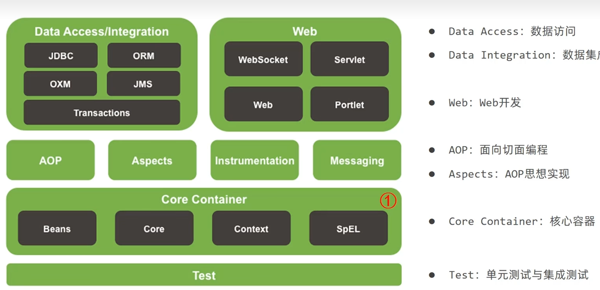

## Spring Framework 核心架构解析

### 一、整体分层架构

Spring 采用分层设计，各层职责清晰且向上层提供支撑，从下到上依次为：

|                   |                                    |                                                            |
| ----------------- | ---------------------------------- | ---------------------------------------------------------- |
| 架构分层              | 核心模块                               | 核心作用                                                       |
| **基础设施层**         | spring-core、spring-jcl             | 提供核心工具类（如BeanUtils）、日志适配（JCL），是所有模块的基础依赖。                  |
| **核心容器层**         | spring-beans、spring-context        | 实现 IoC 容器（BeanFactory/ApplicationContext）、Bean 定义与生命周期管理。  |
| **AOP/Aspects 层** | spring-aop、spring-aspects          | 提供 AOP 核心能力，支持 AspectJ 注解式切面开发（如日志、事务增强）。                  |
| **数据访问层**         | spring-jdbc、spring-tx、spring-orm   | 封装 JDBC 操作、声明式事务管理，适配 ORM 框架（MyBatis、Hibernate 等）。         |
| **Web 层**         | spring-web、spring-webmvc           | 提供 Servlet 集成、Spring MVC 核心能力（DispatcherServlet、控制器、视图解析）。 |
| **扩展层**           | spring-test、spring-context-support | 单元测试支持（如@SpringBootTest底层）、第三方框架集成（EhCache 等）。             |

### 二、模块依赖关系（底层→上层）

- **基础设施层** → 所有模块：spring-core和spring-jcl是全局依赖。

- **核心容器层** → AOP 层、数据访问层、Web 层：上层模块需通过 IoC 容器获取 Bean。

- **AOP/Aspects 层** → 数据访问层、Web 层：支持对事务、控制器等进行切面增强。

- **数据访问层** → 无上层依赖：仅依赖核心容器层，提供数据访问能力。

- **Web 层** → 无上层依赖：依赖核心容器层和 AOP 层，处理 HTTP 请求。

### 三、核心模块关键组件

|   |   |   |
|---|---|---|
|模块|核心组件 / 注解|典型场景|
|spring-context|ApplicationContext、@Component|IoC 容器初始化、Bean 自动扫描|
|spring-webmvc|DispatcherServlet、@Controller|请求分发、MVC 控制器定义|
|spring-tx|@Transactional、PlatformTransactionManager|声明式事务管理|
|spring-aop|@Aspect、@Before|切面定义、前置通知等 AOP 操作|

## Spring Framework bean使用
### 一、IOC（控制反转）与DI（依赖注入）
- 