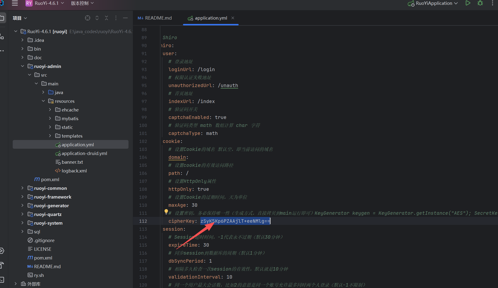

### 一、若依常用框架

```
alibaba druid          
alibaba nacos          
spring            
redis            
mysql            
minio            
fastjson            
shiro            
swagger-ui.html          
mybatis

fofa:(icon_hash="-1231872293" || icon_hash="706913071")
hunter:web.body="若依后台管理系统"
源网站[介绍 | RuoYi](https://doc.ruoyi.vip/ruoyi/)
https://github.com/yangzongzhuan/RuoYi

git clone 
```

### 前台打法

#### 1.弱口令

```
针对若依框架的web登录口,minio,druid服务

用户：admin ry ruoyi druid            
密码：admin123 123456 admin druid  admin888

其他默认密码 mysql数据库
用户：root
密码：password
```
#### 2.前台漏洞
##### 2.1shiro默认密钥RCE漏洞（版本小于等于v4.6.1）
```

zSyK5Kp6PZAAjlT+eeNMlg==
```
代码审计位置：application.yml -> cipherKey


